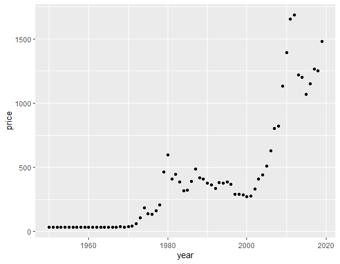
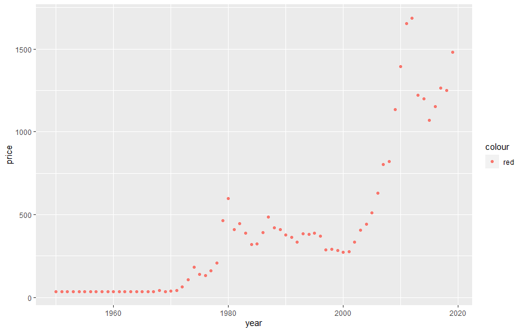
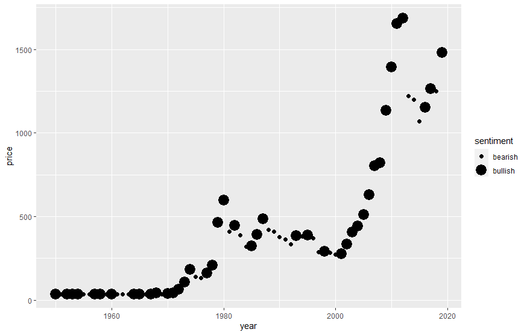
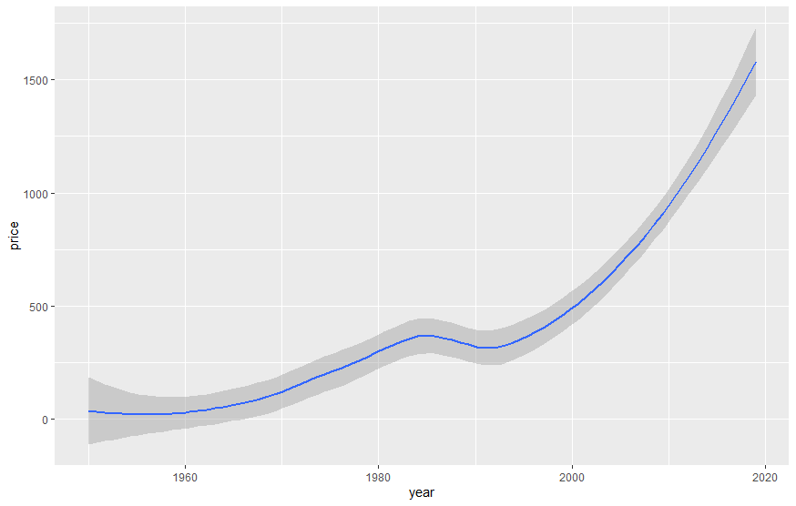

## Summary

This post will walk you through how to visualize various types of data through ggplot2.

------------------------

## The dataset

First we need to load the tidyverse package in order to gain access to ggplot2 and other functions and datasets. 


```
library(tidyverse)
-- Attaching packages ----------------------- tidyverse 1.3.1 --
v ggplot2 3.3.5     v purrr   0.3.4
v tibble  3.1.2     v dplyr   1.0.7
v tidyr   1.1.3     v stringr 1.4.0
v readr   1.4.0     v forcats 0.5.1
-- Conflicts -------------------------- tidyverse_conflicts() --
x dplyr::filter() masks stats::filter()
x dplyr::lag()    masks stats::lag()
```
Below we'll load some data on gold prices taken from [datahub.io](https://datahub.io/).
```
gold <- read.csv("C:\\Users\\Mtvan\\Desktop\\GoldPrices.csv", fileEncoding = "UTF-8-BOM")
```
A brief look at what the data looks like. 
```
head(gold)

year	price
2014	1200.440
2015	1068.317
2016	1152.165
2017	1265.674
2018	1249.887
2019	1480.025
```
## Creating a ggplot

Every plot starts with the ```ggplot()``` function, where you then supply a dataset and aesthetic mapping with ```aes()```. Various layers can be added like ```geom_point()```, which adds a layer of points to the graph and creates a scatter plot. The x and y arguments tell ggplot which variables to map to the x and y axes.

To plot the data, we run the following code with year on the x-axis, and price on the y-axis.


```
ggplot(gold, aes(x=year, y=price)) +
    geom_point()
```




## Aesthetic Mapping

Other variables, like market sentiment, can be added to a two dimensional scatterplot by mapping it to an aesthetic (a visual property of the objects in the plot). Aesthetics can range anywhere from size, shape, and even color of the points.

```
ggplot(data = gold) +
    geom_point(mapping = aes(x = year, y = price, color = sentiment))
```


To do this, we associate the name of the aesthetic to the name of the variable inside the ```aes()``` fucntion. ggplot2 will automatically assign a unique color of the aesthetic to each unique value (called scaling), while also creating a legend to explain which colors correspond to which values.

If you don't want a legend you can add the following at the end. Be sure to add a ```,``` at the end of the line instead of a ```+```. 
```
show.legend = FALSE
```

You can also manually set the aesthetic properties of the geom manually. 

```
ggplot(data = gold) +
    geom_point(mapping = aes(x = year, y= price, color = "red")
```    



Another possible aesthetic is size. Note you'll receive a warning if you map an unordered variable (market sentiment) to an ordered aesthetic (size).

```
ggplot(data= gold) +
    geom_point(mapping = aes(x = year, y = price, size = sentiment))
Warning message:
Using size for a discrete variable is not advised. 
```





Alpha aesthetic:
```
ggplot(data = gold) +
    geom_point(mapping = aes(x = year, y = price, alpha = sentiment))
```


## Facets

You can split your plot into facets, which will create subplots and divide your data into individual subsets. 
```
ggplot(data = gold) + 
  geom_point(mapping = aes(x = year, y = price)) + 
  facet_wrap(~ sentiment, nrow = 2)
```


## Geometric Objects

The geoms are what determine how ggplot will visually represent your data. There are dozens of geoms available in ggplot2, and even more if you download additional extensions. [Rstudio](https://www.rstudio.com/resources/cheatsheets/) also offers some cheatsheets for quick references. 

```
ggplot(data = gold) + 
  geom_smooth(mapping = aes(x = year, y = price))
```




To display multiple geoms in one plot, add multiple geom functions. 

```
ggplot(data = gold) + 
  geom_point(mapping = aes(x = year, y = price)) +
  geom_smooth(mapping = aes(x = year, y = price))
```

